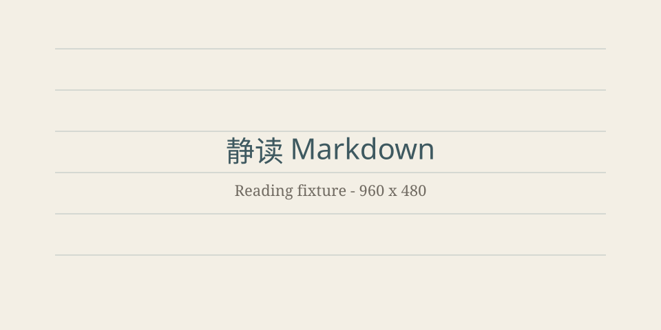

# 长文阅读总览

这份文档用于验证中文长段落、标题折叠、PDF 分页以及阅读位置恢复。

> [!NOTE]
> Callout 应具有独立标题，并且能够折叠而不修改源文件。

## 公式、代码与表格

行内公式 \(E = mc^2\)，块公式如下：

\[
\int_0^1 x^2\,dx = \frac{1}{3}
\]

```typescript
export function readingMinutes(characters: number) {
  return Math.max(1, Math.ceil(characters / 500));
}
```

| 项目 | 目标 |
| --- | --- |
| 正文 | 长时间阅读舒适 |
| 目录 | 不产生配置文件 |
| 导出 | 使用系统 PDF 打印管线 |

## 图片与脚注



折叠图片后应保留一行摘要，放大预览支持滚轮缩放和拖动。[^reader]

[^reader]: 该脚注用于验证分页与脚注渲染。

